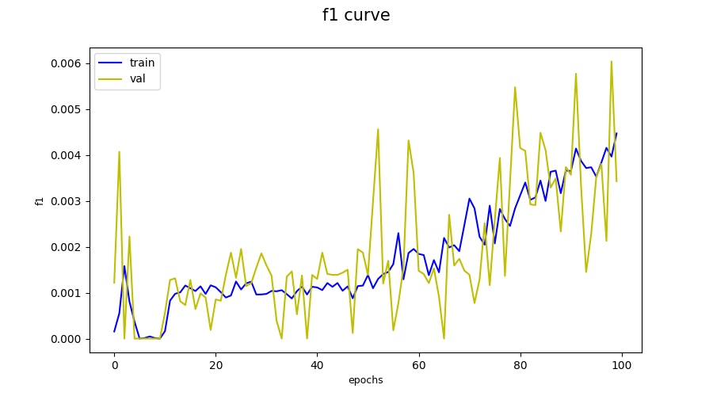

# Named entity recognition lab

## Prerequests
> Python3.12 is used

1. Clone the reposiroty
```bash
git clone https://github.com/LukichevaPolina/nlp_lab_2.git
cd nlp_lab
```

2. Install requirements.txt
```bash
pip3 install -r requirements.txt
```

3. Set up `PYTHONPATH`
```bash
export PYTHONPATH=$PYTHONPATH:$PWD
```

## EDA
Dataset is taken from [github](https://github.com/Babelscape/wikineural/tree/master/data/wikineural/en). The Babelscape/wikineural NER Dataset is a comprehensive and diverse collection of multilingual text data specifically designed for the task of Named Entity Recognition (NER). It offers an extensive range of labeled sentences in nine different languages: French, German, Portuguese, Spanish, Polish, Dutch, Russian, English, and Italian. *We used only English language files*. Dataset consist of three columns with `position in sentence`, `tokens` and `tags`.  
* The tokens column contains the individual words or characters in each labeled sentence. 
* The ner_tags column provides named entity recognition tags for each token, indicating their entity types.
The `tags` is our target, which could take nine different values.  

Dataset contains 3 files:
* The `train.conllu` has 92719 sentences.
* The `test.conllu` has 11596 sentences.
* The `val.conllu` has 11589 sentences.


| Train | Test | Val |
:---------------:|:--------------:|:---------:
 |  | 


| Train | Test | Val |
:---------------:|:--------------:|:---------:
 |  | 


Train:

Test:

Val:


## Preprocessing
Consider removing any unnecessary punctuation marks or special characters unless they carry significant meaning in certain languages.


## Rule based model
### Using Spacy model
Spacy model returns more tags then we need:
* PERSON:      People, including fictional.
* NORP:        Nationalities or religious or political groups.
* FAC:         Buildings, airports, highways, bridges, etc.
* ORG:         Companies, agencies, institutions, etc.
* GPE:         Countries, cities, states.
* LOC:         Non-GPE locations, mountain ranges, bodies of water.
* PRODUCT:     Objects, vehicles, foods, etc. (Not services.)
* EVENT:       Named hurricanes, battles, wars, sports events, etc.
* WORK_OF_ART: Titles of books, songs, etc.
* LAW:         Named documents made into laws.
* LANGUAGE:    Any named language.
* DATE:        Absolute or relative dates or periods.
* TIME:        Times smaller than a day.
* PERCENT:     Percentage, including ”%“.
* MONEY:       Monetary values, including unit.
* QUANTITY:    Measurements, as of weight or distance.
* ORDINAL:     “first”, “second”, etc.
* CARDINAL:    Numerals that do not fall under another type.  

We decided to calculate the most popular target tag for every spacy tag and then map them. This allows us to achieve following results: 
|             | precision |   recall | f1-score |  support |
|--------     | --------  | -------- | -------- |  ------- | 
|         LOC |     0.58  |    0.68  |    0.63  |   5056   |
|        MISC |     0.41  |    0.61  |    0.49  |   3359   |
|         ORG |     0.17  |    0.28  |    0.21  |   2022   |
|         PER |     0.68  |    0.67  |    0.67  |   5226   |
|             |           |          |          |          |
|   micro avg |     0.49  |    0.61  |    0.54  |  15663   |
|   macro avg |     0.46  |    0.56  |    0.50  |  15663   |
|weighted avg |     0.52  |    0.61  |    0.56  |  15663   |

**f1-score:** 0.5433398420918584

### Add custom rules
Custom rules - addind popular oragizations, names, surnames to rules. It changes f1-score marginally.
|             | precision |   recall | f1-score |  support |
|--------     | --------  | -------- | -------- |  ------- | 
|         LOC |     0.57  |    0.72  |    0.63  |    43702 |
|        MISC |     0.42  |    0.63  |    0.50  |    26692 |
|         ORG |     0.19  |    0.30  |    0.23  |    15629 |
|         PER |     0.67  |    0.66  |    0.66  |    40854 |
|             |           |          |          |          |
|   micro avg |     0.50  |    0.63  |    0.56  |   126877 |
|   macro avg |     0.46  |    0.57  |    0.51  |   126877 |
|weighted avg |     0.52  |    0.63  |    0.57  |   126877 |

**f1-score:** 0.5554045698596066

## Deep Learning model
We use Fully Connected Neural Network with IDF encoder of words. We first create vocabulary of the most frequent words from the corpus, then assign this words its idf index. For target encoder we use label encoder. Our architecture implies to construct more features (500) based on the idf. So the result is very poor, we think it occurs because of: 1) our base encoder is very poor (we need complicated encoder, which take into account the position of words), 2) our architecture is not appropriate for this task (maybe we need to more deep layers, but our hardware is not appropriate for this).




**f1-score:** 0.0012173130963674447
